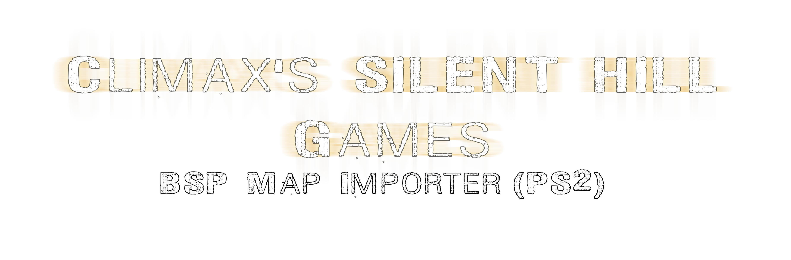

<p align="center">
  
  </p>

<h4 align="center"> 
Blender Add-on for importing BSP maps from Silent Hill games (PS2)
</h4>

<h4 align="center"> 
A Blender add-on that allows you to import BSP files from Silent Hill: Shattered Memories and Silent Hill: Origins (PS2) with complete geometry, materials, textures, UV coordinates, vertex colors, and normals.
  </h4>

## Features

-  Complete BSP map import
-  Geometry with vertices, faces and correct topology
-  Automatic materials and textures
-  UV coordinates
-  Vertex colors
-  Normal maps
-  Triangle strips support

## Installation

### Option 1: Installation from Release (Recommended)

1. Go to [Releases](../../releases) and download `climax_sh_bsp_importer-v1.0.zip`
2. In Blender: **Edit > Preferences > Add-ons**
3. Click **Install** and select the downloaded ZIP file
4. Search for `Climax Silent Hill BSP Importer` and enable the add-on

### Option 2: Manual Installation

1. **Download or clone this repository**
2. **Copy the `climax_sh_bsp_importer` folder** to your Blender scripts directory:
   - **Windows**: `%APPDATA%\Blender Foundation\Blender\<version>\scripts\addons\`
   - **Linux**: `~/.config/blender/<version>/scripts/addons/`
   - **macOS**: `~/Library/Application Support/Blender/<version>/scripts/addons/`
3. Open Blender and go to **Edit > Preferences > Add-ons**
4. Search for `Climax Silent Hill BSP Importer` and enable the add-on

## Usage

### Preparing Files

BSP files should be organized as follows:

```
your_map_folder/
├── your_map.bsp              (Silent Hill: Origins or Silent Hill: Shattered Memories)
├── texture_name1.png
├── texture_name2.png
└── ...
```

**Note:** The add-on supports both `.bsp` and `.shsm_bsp` extensions. If you have conflicts with other plugins, you can rename to `.shsm_bsp`.

### Import

1. **File > Import > Silent Hill BSP (.bsp / .shsm_bsp)**
2. **Select** the `.bsp` or `.shsm_bsp` file
3. Textures will be automatically loaded from the `Textures/` directory
4. Done! The map will be imported with all its geometry and materials

### Supported Games (Currently)

- **Silent Hill: Shattered Memories** (PS2)
- **Silent Hill: Origins** (PS2)

## License

This project is community-driven and available for personal and educational use.

---

Issues? Report them in the issues section.
